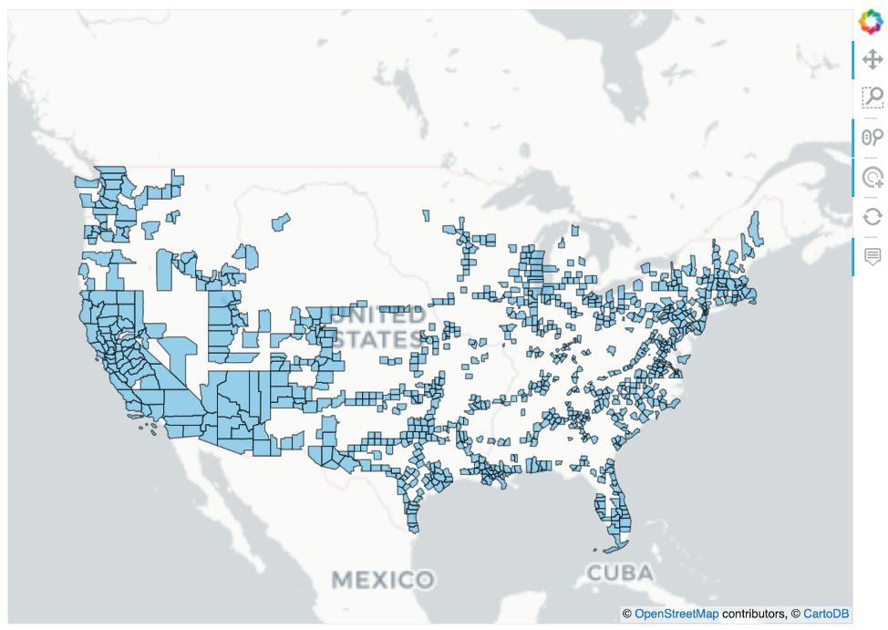
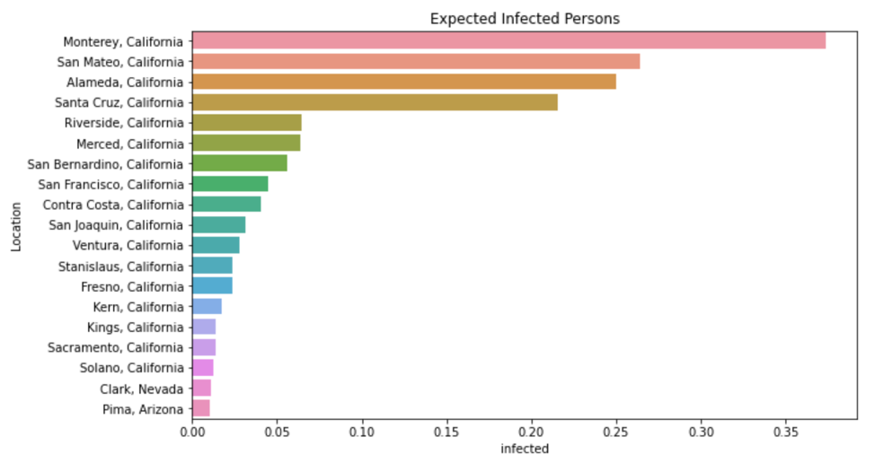
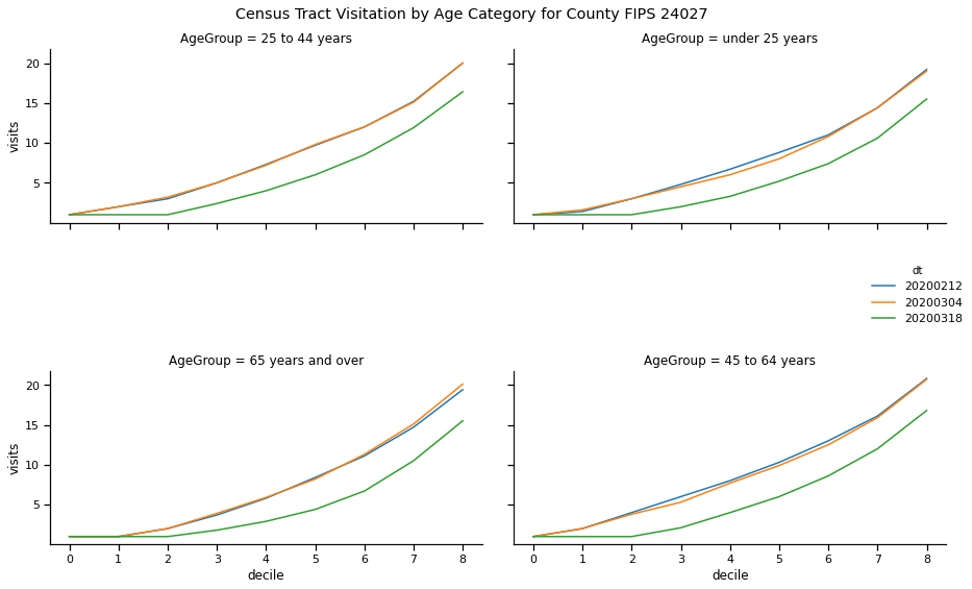
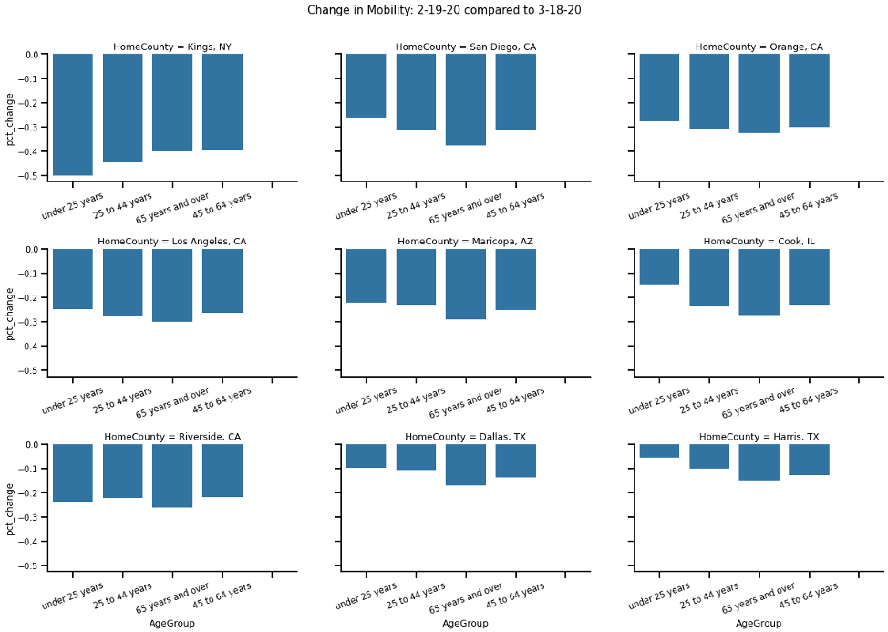

## TruFactor COVID-19 Data & Notebooks
This repo is intended to public facing notebooks and code which helps
 researchers, policy makers and others understand how COVID-19 has 
 changed population behavior. 
 
 The notebooks repo contains examples of how to work with relevant TruFactor 
 datasets. Supporting datasets are included in the nested _Data_ directory.
 
### TruFactor IntraCounty and InterCounty Geo Mobility Data 
TruFactor’s IntraCounty and InterCounty Geo Mobility data aims to provide a national and regional
understanding of mobility changes across a significant portion of the United States
while maintaining individual privacy. This dataset is intended to enable researchers, 
public officials and citizens understand how population-level behaviors are changing 
due to COVID-19 and the ensuing national, state and local response.

**Datasets**

The InterCounty Geo Mobility dataset provides travel behaviors at a daily frequency. 
This dataset produces estimates of what counties a resident population is traveling to.
The InterCountyMobility dataset is essentially a daily transition matrix, representing
transmission vectors between counties, where successful implementation of the public
health stay at home can be characterized by the localized increases in the trace of the
matrix. In addition to characterizing stay at home measures, an example use of this dataset 
would be to model how a virus could spread overtime or potential use could be for 
modeling economic impacts due to reduced mobility patterns. The schema for 
InterCountyMobility dataset is provided below:

**InterCounty Geo Mobility**

|Column	            |  Description	|
|-------------------|-----------|
|home_county	    |County from which a population resides. Estimated based on location behavior.|
|visited_county	    |County which a population traveled through. This could be either simply passing through or dwellingin the county.|
|visited_percentage |Percent of population from home county which visited a visited county.|
|visited_deviation  |Estimate of potential error in percent visited. Since estimates are based on a sample of the population, each sample has an associated weight. These samples are bootstrapped 1000 times with replacement to provide an estimate of the potential error. Smaller samples with larger weights will have more error than large samples with smaller weights.	Double|

Using this dataset one could calculate potential COVID-19 exports. Given a set of infected counties, it is possible to 
calculate inflows to non-infected counties in a period and thus alter those non-infected counties infection forecasts. 
On 2/12/20, there are 12 COVID-19 cases of which 7 were reported in US counties. Those counties are shown below. The map
shows all the other counties residents of the infected counties traveled to. Finally, the last plot shows how travel from
an infected county to noninfected counties can lead to nontrivial probable infection rates.

The table shows the sum of the expected infections based on infected county residents travel into noninfected counties. 
While the expected infections are small, 0.35 people in Monterey for instance, they are nonzero. Using these new nonzero 
probabilities, a researcher could build a SIR model to model the potential spread of COVID in these newly exposed counties. 
Below we show an example using Pima County, AZ:

- Infected count as .01068 persons
- Population of 1,047,279 and 50% are susceptible
- Contact rate of 2.5 persons
- Latency of 14 days

The IntraCountyMobility dataset provides intra-county estimates of how mobility behaviors are changing by demographic 
group. We measure the change in travel behavior for a county’s residents by providing a decile distribution of the # of 
visited census tracts within the county. Travel behaviors for residents within a county by demographic group are provided 
to show how mobility is changing by age group at a daily frequency. Researchers and policymakers can understand how 
behaviors are changing in response to infection rates and policy shocks such as Stay At Home policies. The schema for 
IntraCountyMobility is provided below.

 **InterCounty Geo Mobility**

|Column	            |  Description	|
|-------------------|-----------|
|home_county	    |County from which a population resides. Estimated based on location behavior.|
|age_group    |Age group of the population|
|visit_deciles |An array showing the county residents distribution of the # of distinct census tracts visited. Deciles cutoffs are [.1,.2,.3,.4,.5,.6,.7,.8,.9]|
|visit_deciles_deviation  |An array showing the deviation in a given decile distribution. These samples are bootstrapped 1000 times to provide an estimate of the potential error in the distribution. |

An example of the decile distribution can be used is provided below. Comparing two dates, a researcher can look at the 
area under the curve (AUC) of a visit distribution between two time periods and calculate the relative change.

In the above plot, it is clear that social distancing didn’t occur between early February and early March. However, by 
mid March, we see a significant flattening. By March 18th, most of the deciles across all age groups experience a 
distinct shift down and to the right. Interestingly, we see a flattening of the curve across the first several deciles. 
If the 2nd decile is 1, this implies 30% of people did not visit more than a single census tract that day. Basically, 
they stayed home!

To compute a single measure which can be compared across time, a researcher can simply calculate the AUC for each age 
category and date. This can be done simply by summing the visits across the deciles. Then AUC can be compared across 
two-time intervals. When looking at the 9 largest counties response in the US we see social distancing has increased 
(i.e. intracounty mobility has decreased).

